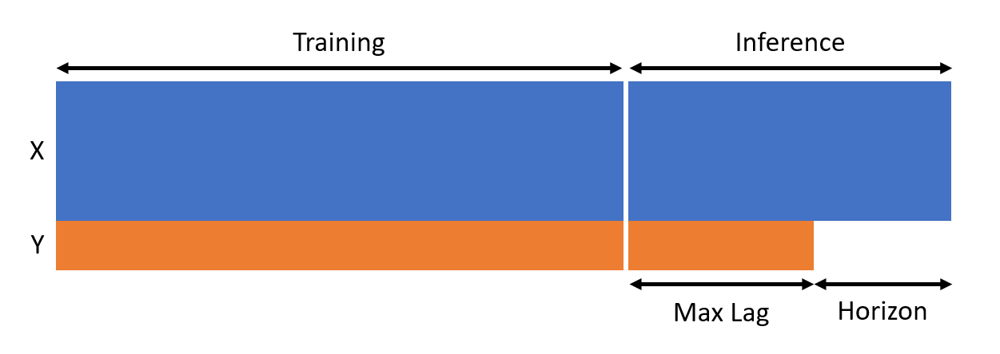

# A Better Azure ML Many Models Forecasting Example

*By: Zachary Pulliam*

## Goal

This project is an attempt to create a better example than those available to demonstrate the use of Azure Machine Learning to train and deploy multiple forecasting models using Azure ML's Many Models capability.

Many available examples do not make use of Azure ML's lag feature capability, which is crucial when attempting to forecast in an auto-regressive approach. Not using lagged values of the dependant variable results in a strictly prediction style model, relying on features other than historic values, rather than using historic values as a feature. It is not explained in available Microsoft documentation how to format the data to make use of lags when using the many models approach, so I will do my best to explain it in the *Key Differences* section below.

I have recreated the Orange Juice sales example that is popular to make use of lags and attempt to build a sound forecasting approach in Azure ML.

## Key Differences

Typically, when creating a forecasting model, the model would be trained on the most recent data, so that the model is up to date on the most recent behavior of the time-series. Then when creating a forecast, the recent time-series data, plus available future features which may influence the behavior of the time-series. However, in AzureML, things must be done slightly differently. AzureML will not allow data used during the training of the forecasting model to be passed through the model during inference, therefore, if the model is trained on the most recent data, there will be no lags available during inference and the model will have to rely on other feature variables to make the forecast. In order to use lagged values during inference, the most recent historical data must be separated from the training data and used for inference only. While this is not the typical approach to forecasting, it is the way it must be done in AzureML if you wish to use lagged values. In order to be sure the model has access to all lagged values requested, the data must be split at the max lag value previous of the timestamp where the forecast should begin. An illustration below depicts how the data split should look.



## Overview

Azure Machine Learning's Many Models capability enables the efficient training and hyperparameter tuning of multiple machine learning algorithms over each partition of a dataset. After a training is completed, this allowing for easy inference based n partitions and specific model versions or tags.

This example provides a demonstration of the following steps:

- **Data Preparation:** Exploring and preparing the dataset for training multiple models. In this example, I am using Azure's Orange Juice sales example dataset which has weekly orange juice sales for different brands at different stores.
- **Model Training:** Training multiple models over each time-series using different algorithms or hyper-parameters.
- **Inference:** Performing inference using the trained many models endpoint.
- **Publishing Pipelines:** Demonstration of how to publish the training and inference pipelines to be reused or scheduled.
- **Scheduling Pipelines:** Example code on how to schedule a pipeline to run at a given time interval, in the case that data is updated according to the schedule and models need to be retrained and inference can run on a schedule to produce a forecast.

## Prerequisites

To run this example, you will need:

- An Azure subscription. If you don't have one, create a [free Azure account](https://azure.microsoft.com/free/).
- An Azure Machine Learning workspace. Create one using the [Azure portal](https://portal.azure.com/) or Azure CLI.
- Python environment with Azure ML SDK and AutoML dependencies installed. You can install the SDK via pip:

  ```bash
  pip install azureml-sdk
  pip install azureml-train-automl
  ```

- The azureml-contrib-automl-pipeline-steps package that is needed for many models.You can install the package via pip:

  ```bash
  pip install azureml-contrib-automl-pipeline-steps
  ```

## 00_Setup_AML_Workspace.ipynb

**Description:**

This notebook guides users through the process of creating an Azure ML Workspace, a centralized hub for managing machine learning resources, experiments, datasets, models, and deployment targets.

**Contents:**

*Azure Subscription and Resource Group:* Instructions to ensure the availability of an Azure subscription and the creation of an Azure Resource Group, which acts as a container for resources.

*Azure ML Workspace Creation:* Step-by-step guidance on creating an Azure ML Workspace using Azure Python SDK (Software Development Kit). This includes specifying workspace details, subscription, resource group, and location.

*Workspace Configuration:* Details on how to configure and access the workspace using Python SDK. This section covers authentication, workspace access, and verification steps.

## 01_Data_Prep.ipynb

**Description:**

This notebook contains the code to prepare the data for a simple many models machine learning forecasting experiment.

**Contents:**

*Prepare Data:* Download the data locally so that it can be processed to create a realistic forecasting example and then uploaded to Blob from the development machine.

*Upload and Register Dataset:* Upload the prepared data to Azure Blob storage and register to the Azure ML Workspace so that Azure ML can then reference the data for training many forecasting models.

## 02_Pipeline.ipynb

**Description:**

This notebook guides users through the process of creating an Azure ML Many Models Pipeline, that includes data preparation, many models training and hyperparameter tuning, model registration, and many models inferenece using the Azure ML Many Models feature.

**Contents:**

*Create Azure ML Environment*: Create a container used to run steps within the pipeline.

*Connect to Resources and Name Experiment:* Connect to the proper resources needed throughout the training and inference pipelines and name the training and inference experiments.

*Load Training Data:* Call the required datasets for training as data assets in the Azure ML Workspace to be passed into the training pipeline and establish an output destination for preprocessed data created by any PythonScript steps running prior to the Many Models step.

*Build Training Pipeline:* Define any PythonScript steps that need to run during the pipeline and define the parameters for training of many models over the dataset.

*Publish/Schedule Training Pipeline:* Publish the training pipeline to the Azure ML Workspace so it can be saved and referenced for scheduling.

*Load Inference Data:* Call the required datasets for inference as data assets in the Azure ML Workspace to be passed into the inference pipeline and establish an output destination for preprocessed data created by any PythonScript steps running prior to the Many Models step, as well as the forecast output.

*Build Inference Pipeline:* Define any PythonScript steps that need to run during the pipeline and define the parameters for inference of many models over the dataset.

*Publish/Schedule Inference Pipeline:* Publish the inference pipeline to the Azure ML Workspace so it can be saved and referenced for scheduling.
